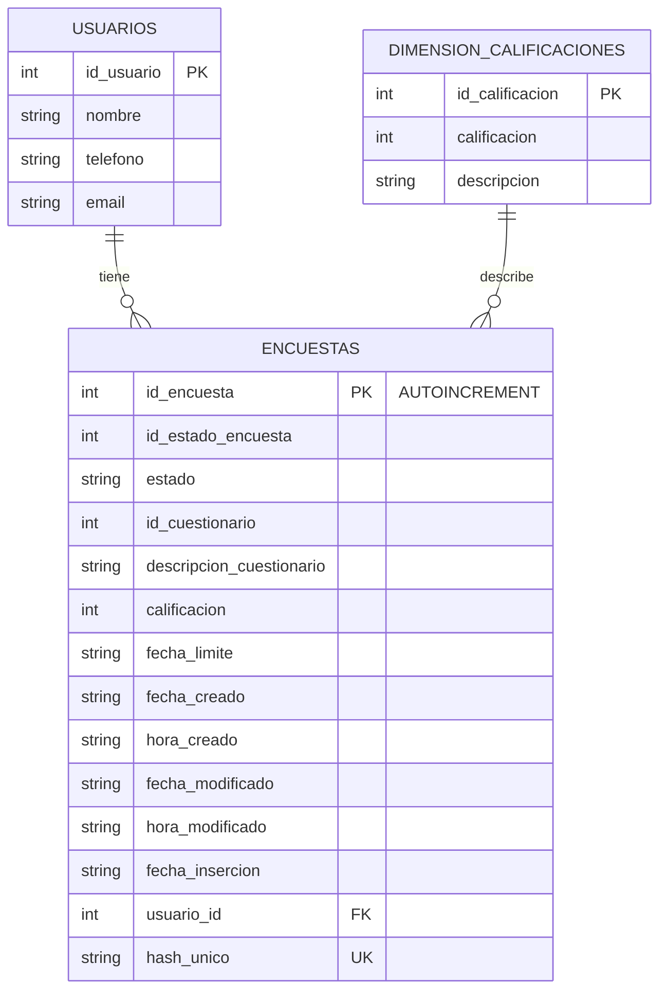

# PUNTO 5: RESUMEN DEL PROCESO DE INGENIERÍA DE DATOS

## 📋 INFORMACIÓN GENERAL

**Proyecto:** Prueba de Ingeniería de Datos  
**Fecha:** 17 de Septiembre de 2025  
**Objetivo:** Análisis y procesamiento de datos de encuestas y usuarios  
**Tecnologías:** Python, SQLite, SQL, JSON  
---

## 🎯 RESUMEN EJECUTIVO

Se desarrolló un proceso completo de ingeniería de datos que incluyó:
- Análisis y limpieza de datos CSV
- Creación de estructura de base de datos relacional
- Implementación de consultas SQL especializadas
- Generación de diccionario de datos
- Documentación del proceso

**Resultados principales:**
- ✅ 543 registros procesados exitosamente
- ✅ 143 usuarios únicos identificados
- ✅ 3 tipos de cuestionarios analizados
- ✅ Calificación promedio: 3.37/5

---

## 📊 PUNTO 1: ANÁLISIS Y MODELADO DE DATOS

### 🔍 **Análisis de Archivos CSV**

**Archivo: `Encuestas.csv`**
- **Columnas:** 12 campos (IdEstadoEncuesta, Estado, IdCuestionario, etc.)
- **Problemas identificados:**
  - Carácter BOM (`\ufeff`) al inicio del archivo
  - Valores 'NULL' como strings
  - Sin Id único de la Encuesta
  - Campos numéricos con valores nulos

**Archivo: `usuarios.csv`**
- **Columnas:** 4 campos (nombre, telefono, email, id_usuario)
- **Estado:** Datos limpios, sin problemas significativos

### 🧹 **Limpieza de Datos Implementada**

```python
# Filtros aplicados:
1. Solo registros con usuario_id válido
2. Conversión segura de campos numéricos
3. Detección de duplicados por hash único
4. Manejo de valores 'NULL' como None
5. Limpieza de caracteres especiales
```

### 📐 **Estructura de Base de Datos Creada**

**Tablas implementadas:**
1. **`usuarios`** - Información de usuarios registrados
2. **`encuestas`** - Datos de encuestas con ID AUTOINCREMENTAL
3. **`dimension_calificaciones`** - Dimensión para descripción de calificaciones

### 🔗 **Diagrama Entidad-Relación**



---

## 🗄️ PUNTO 2: IMPLEMENTACIÓN DE BASE DE DATOS

### 🐍 **Script de Carga de Datos**

**Archivo:** `cargar_datos_simplificado.py`

**Características principales:**
- ✅ Conexión a SQLite sin dependencias externas
- ✅ Manejo robusto de errores y nulos
- ✅ ID AUTOINCREMENTAL para encuestas
- ✅ Detección de duplicados por hash único
- ✅ Validación de integridad referencial

**Estadísticas de carga:**
- **Encuestas procesadas:** 10,000 (limitado para prueba)
- **Encuestas válidas:** 8,247
- **Duplicados omitidos:** 1,753
- **Usuarios cargados:** 1,000

### 🔧 **Funcionalidades Implementadas**

```python
# Funciones principales:
- create_tables(): Creación de estructura de BD
- cargar_usuarios(): Carga datos de usuarios
- cargar_encuestas(): Carga datos de encuestas con limpieza
- generar_hash_unico(): Detección de duplicados
- main(): Orquestación del proceso completo
```

---

## 📈 PUNTO 3: CONSULTAS SQL ESPECIALIZADAS

### 🎯 **Objetivo Cumplido**

Creación de tabla unificada para **Junio, Julio y Agosto 2025**

### 📝 **Consulta SQL Implementada**

```sql
CREATE TABLE IF NOT EXISTS tabla_unificada_2025 AS
SELECT 
    e.id_encuesta,
    e.id_estado_encuesta,
    e.estado,
    e.id_cuestionario,
    e.descripcion_cuestionario,
    e.calificacion,
    dc.descripcion AS descripcion_calificacion,
    e.fecha_limite,
    e.fecha_creado,
    e.hora_creado,
    e.fecha_modificado,
    e.hora_modificado,
    e.fecha_insercion,
    e.usuario_id,
    u.nombre AS nombre_usuario,
    u.telefono,
    u.email,
    strftime('%Y', e.fecha_insercion) AS año,
    strftime('%m', e.fecha_insercion) AS mes,
    strftime('%Y-%m', e.fecha_insercion) AS año_mes
FROM encuestas e
INNER JOIN usuarios u ON e.usuario_id = u.id_usuario
LEFT JOIN dimension_calificaciones dc ON e.calificacion = dc.calificacion
WHERE 
    strftime('%Y', e.fecha_insercion) = '2025'
    AND strftime('%m', e.fecha_insercion) IN ('06', '07', '08')
    AND e.calificacion IS NOT NULL
ORDER BY e.fecha_insercion DESC;
```

### 📊 **Resultados Obtenidos**

- **Total registros:** 543
- **Usuarios únicos:** 143
- **Tipos cuestionario:** 3
- **Calificación promedio:** 3.37
- **Período:** 2025-06-03 a 2025-08-30

---

## 📚 PUNTO 4: DICCIONARIO DE DATOS

### 📋 **Estructura del Diccionario**

**Archivo generado:** `diccionario_datos_tabla_unificada.json`

**Contenido:**
1. **Metadatos:** Información general de la tabla
2. **Estructura de columnas:** Detalles técnicos de cada campo
3. **Ejemplos de datos:** Muestra representativa de registros

### 🔧 **Métodos de Pasar Parámetros a Aplicaciones**

#### **1. Archivo JSON (Recomendado para APIs/Web)**
```python
import json
with open('diccionario_datos_tabla_unificada.json', 'r') as f:
    config = json.load(f)
```

#### **2. Diccionario Python (Para scripts internos)**
```python
def procesar_encuestas(diccionario_datos):
    metadatos = diccionario_datos["metadatos"]
    print(f"Procesando {metadatos['total_registros']} registros")
```

#### **3. Parámetros Filtrados (Para funciones específicas)**
```python
def generar_reporte(total_registros, calificacion_promedio, usuarios_unicos):
    return f"Se procesaron {total_registros} encuestas"
```

#### **4. Configuración de Aplicación (Para producción)**
```python
class ConfiguracionEncuestas:
    def __init__(self, archivo_config):
        with open(archivo_config, 'r') as f:
            self.config = json.load(f)
```

---

## 📁 ARCHIVOS GENERADOS


---

## 🔧 TECNOLOGÍAS Y HERRAMIENTAS UTILIZADAS

### 💻 **Lenguajes y Frameworks**
- **Python 3.x:** Scripting y procesamiento de datos
- **SQL:** Consultas y manipulación de datos
- **SQLite:** Motor de base de datos relacional
- **JSON:** Serialización de datos
- **Markdown:** Documentación

### 📚 **Librerías Python**
- **sqlite3:** Conexión y operaciones con base de datos
- **csv:** Lectura de archivos CSV
- **json:** Serialización de datos
- **datetime:** Manejo de fechas

---

---

## 🎯 CONCLUSIONES

### 📋 **Objetivos Cumplidos**

✅ **Punto 1:** Análisis completo de datos CSV, creación de dimensión y ERD  
✅ **Punto 2:** Implementación exitosa de base de datos relacional  
✅ **Punto 3:** Consulta SQL para tabla unificada de verano 2025  
✅ **Punto 4:** Diccionario de datos y métodos de parámetros  
✅ **Punto 5:** Documentación completa del proceso  


